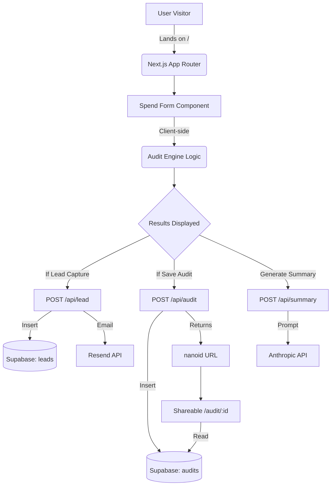

# Architecture

## System Diagram

## Data Flow Explanation
1. User enters tools on the client side. Data is persisted to `localStorage`.
2. `AuditEngine` runs entirely in the browser (zero latency, zero server cost) to produce `AuditResult`.
3. Results are displayed immediately.
4. Concurrently, `/api/summary` calls Anthropic to get a 100-word summary, which updates the UI when ready.
5. `POST /api/audit` saves the non-PII audit results to the public `audits` table in Supabase and returns an ID for sharing.
6. The user submits their email to `/api/lead`, which saves to the private `leads` table and triggers a Resend email.

## Stack Justification
- **Next.js**: Provides the fastest route to a full-stack app with SSR needed for Twitter Card/OG tags on shareable URLs.
- **Supabase**: Instant Postgres with RLS allows us to securely separate public audits from private leads without spinning up a separate backend or managing auth manually.
- **Tailwind + shadcn**: Enables rapid UI development with accessible, high-quality components that look premium out of the box.

## 10k Audits/Day Scaling Plan
At 10k audits/day (~7/min):
- **Frontend**: Vercel's edge network easily handles this static traffic.
- **Database**: Supabase free tier (500MB) can hold ~250k audits. We'd upgrade to the $25/mo Pro plan for 8GB storage and better compute.
- **AI API**: Anthropic Haiku costs ~$0.00025 per prompt. 10k/day = $2.50/day. No rate limit issues on Tier 2+.
- **Bottleneck**: Email sending (Resend). 10k leads/day exceeds the free tier. We would upgrade to Resend Pro or switch to Amazon SES for bulk transactional emails.
